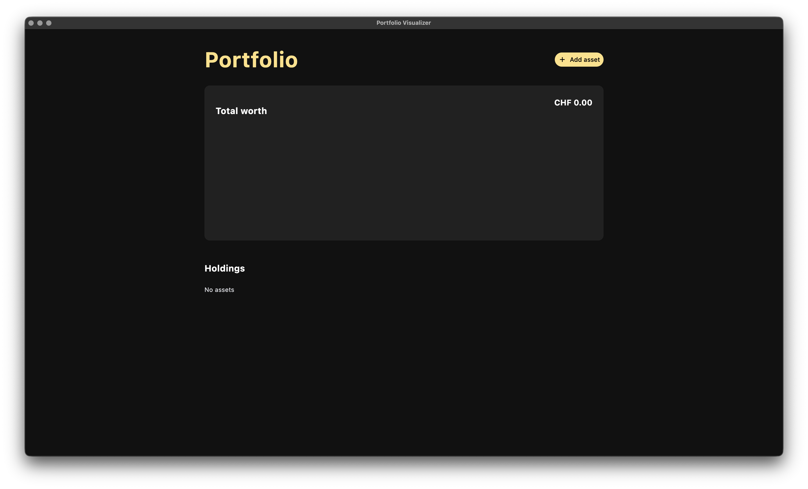
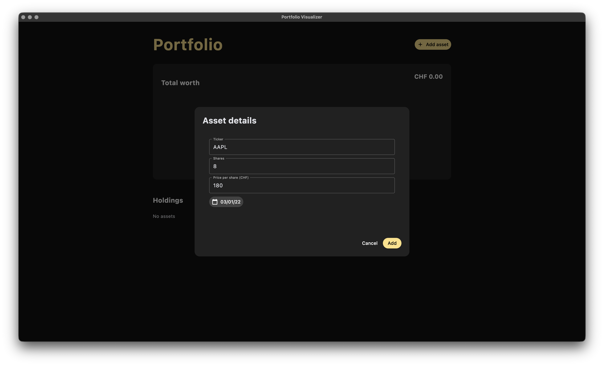
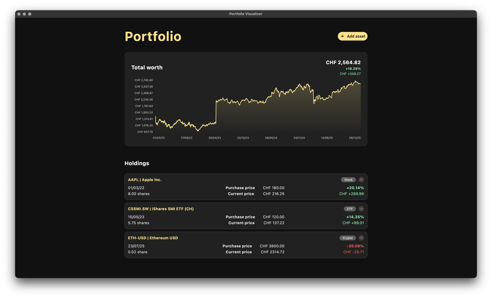

# Portfolio Visualizer

Simple single file Python desktop app built with Flet. It lets the user add assets, then displays the portfolio's total value over time and shows a holdings list with per asset performance metrics.

Data sources:
- Market prices and metadata are fetched from Yahoo Finance via `yfinance`
- FX conversion to CHF uses Yahoo Finance FX tickers such as `USDCHF=X`

Base currency:
- All values displayed in the UI are in CHF
- Purchase prices are entered in CHF, the app does not convert the entered purchase price from another currency

---

## Screenshots

### 1. Empty application state
This screenshot shows the application immediately after launch, before any assets are added.

### 2. Asset input form filled
This screenshot shows the asset input form filled with an example asset (AAPL), before submission.

### 3. Portfolio overview
This screenshot shows the portfolio overview after adding multiple assets (AAPL, CSSMI.SW, ETH-USD).

Note: Totals, holdings, and performance will differ depending on tickers, dates, and the current market price when assets are added.

---

## Features

- Add assets via an “Asset details” dialog:
  - Ticker (text)
  - Shares (numbers only, supports decimals)
  - Price per share (CHF), numbers only, supports decimals
  - Purchase date (selected via a date picker)
- Validations enforced when adding:
  - Ticker must be non empty
  - Shares must be greater than 0
  - Price per share must be greater than 0
  - Purchase date must be selected and cannot be in the future
  - Purchase date cannot be earlier than the first available Yahoo Finance price date for that ticker
  - Ticker must be valid, the app must be able to fetch a current price for it
- Holdings list:
  - Shows `TICKER | longName` (longName comes from Yahoo Finance metadata and can be missing for some tickers)
  - Shows an asset type badge derived from Yahoo Finance `quoteType` (Stock, ETF, Fund, Crypto, Index, Other)
  - Shows purchase date, shares, purchase price (CHF), current price (CHF), percentage gain/loss, and profit/loss in CHF
  - Allows removing an asset via the close icon on the holding card
- Total worth chart:
  - Builds a CHF time series using daily close prices from Yahoo Finance
  - Converts non CHF assets to CHF using an FX series to CHF
  - Trims each asset series to start at its purchase date
  - Sums all assets into a single total portfolio value series

---

## Important limitations

- No persistence: assets are stored only in memory in a Python list, closing the app clears the portfolio
- No live refresh: current prices are fetched when an asset is added, values do not auto update during the session

---

## Requirements

- Python 3.12.0
- Internet connection (Yahoo Finance is required for price and FX queries)

Python packages (from the code imports):
- `flet 0.28.2` 
- `yfinance 1.0`
- `pandas 2.3.3`
